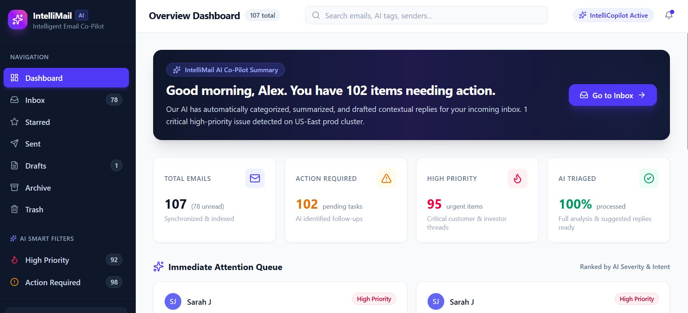

# IntelliMail

### AI-Powered Email Intelligence & Response Assistant

IntelliMail is a full-stack AI-powered email management application that helps users understand, organize, and respond to emails more efficiently.

It uses Gemini AI to analyze emails based on **category, priority, sentiment, intent, summary, and action required**, while also generating AI-assisted reply suggestions.

## 📸 Screenshots

### Dashboard


---

## ✨ Features

- 🤖 **AI Email Analysis**
  - Email category classification
  - Priority detection
  - Sentiment analysis
  - Intent detection
  - Automatic email summarization
  - Action-required detection
  - AI confidence score

- ✉️ **Email Management**
  - Inbox
  - Sent
  - Drafts
  - Starred
  - Archive
  - Trash
  - Read / unread status

- 💬 **AI-Powered Replies**
  - Generate suggested replies
  - Choose reply tone
  - Edit generated replies
  - Send replies directly from the application

- 🔔 **Notifications**
  - Highlights unread
  - High-priority
  - Action-required emails

- 💾 **Persistent Storage**
  - Email data and user actions are stored in Supabase.

---

## 🛠️ Tech Stack

### Frontend
- React.js
- Vite
- JavaScript
- CSS

### Backend
- Python
- FastAPI
- REST APIs

### AI
- Google Gemini API

### Database
- Supabase

---

## 🏗️ Architecture

```text
                 ┌─────────────────────┐
                 │     React Frontend  │
                 │      + Vite         │
                 └──────────┬──────────┘
                            │
                       REST API
                            │
                            ▼
                 ┌─────────────────────┐
                 │     FastAPI         │
                 │      Backend        │
                 └──────┬───────┬──────┘
                        │       │
                ┌───────▼───┐ ┌─▼────────────┐
                │  Gemini   │ │   Supabase   │
                │    AI     │ │   Database   │
                └───────────┘ └──────────────┘